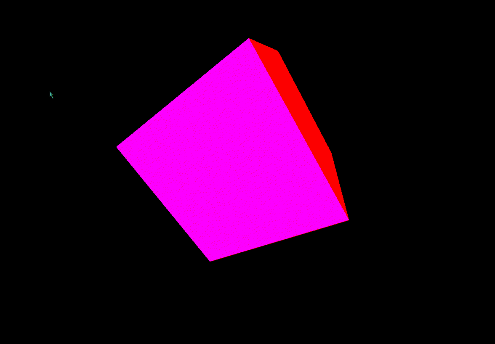

# Rotating-3D-Cube-OpenGL

This is a simple 3D cube that rotates in OpenGL. It is written in C++ and uses the OpenGL library. It is a simple project that was made for Lab assignment of the course Computer Graphics (CSC 209). 

## Demo 



## Pre-requisites

* OpenGL
* C++ compiler

## How to run

* Clone the repository

```bash
git clone https://github.com/tyzrex/Rotating-3D-Cube-OpenGL
```

* Compile the code

```bash
g++ main.cpp -lGL -lGLU -lglut
```

* Run the executable

```bash
./a.out
```
